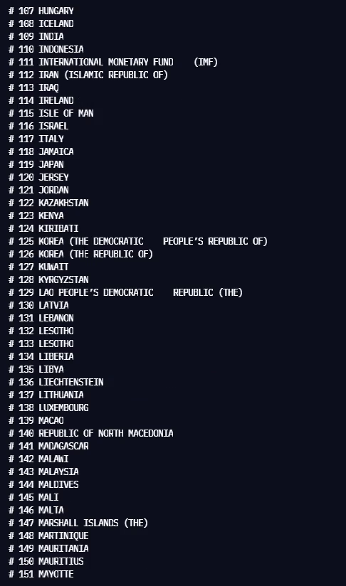
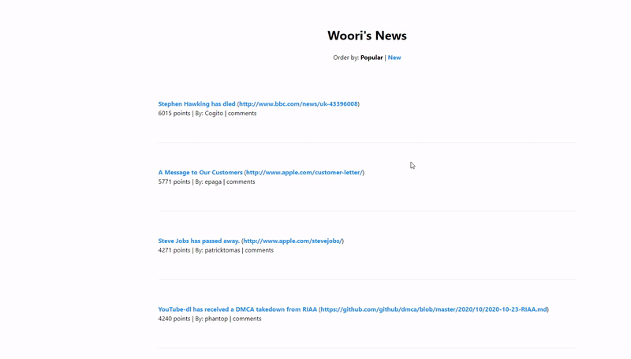
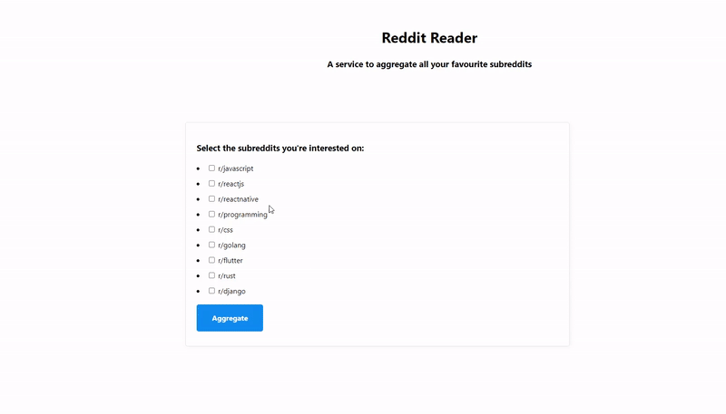
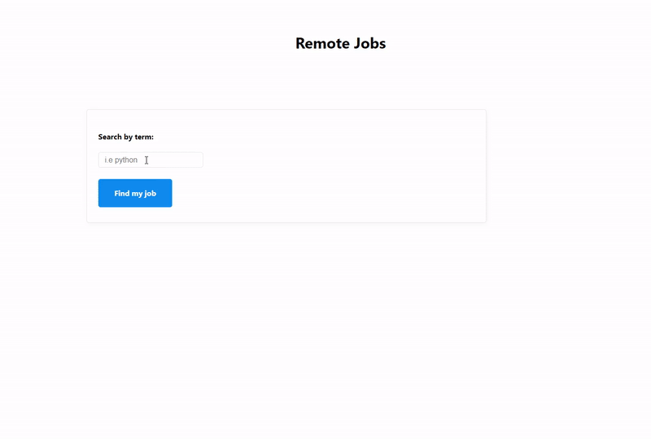

# Nomad_py_Challenge

## Day4: Check Valid URL

## Day5: Print Currency Code

    ◻ It takes country list from https://www.iban.com/currency-codes.
    ◻ It prints selected country's currency code.

## Day6: Exchange

    ◻ It applys the exchange rate between selected countries.

## Day8: Part-time-job Information

    ◻ It scraps part-time-job information from http://www.alba.co.kr.

## Day9: Woori's news

    ◻ It scraps information from http://hn.algolia.com/api/v1

## Day11&12: Search Jobs by Language

    ◻ It scraps information from https://reddit.com.

## Day13&14: Search Jobs by Field

    ◻ It scrap information from https://stackoverflow.com/jobs?r=true&q=python,
       https://weworkremotely.com/remote-jobs/search?term=python, https://remoteok.io/remote-dev+python-jobs.